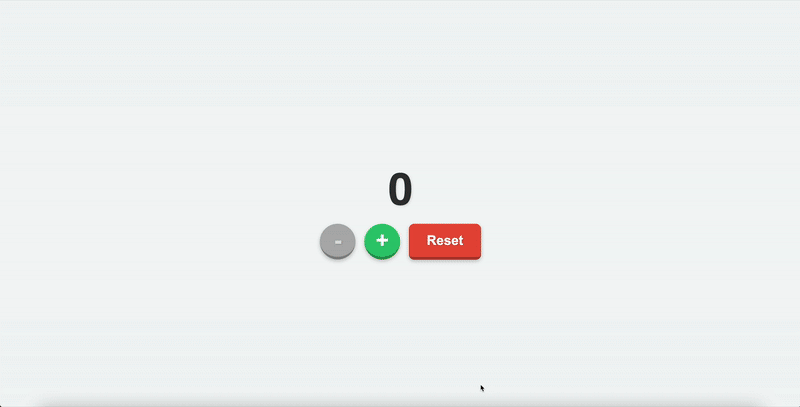

# React Revival: A Collection of Practice Projects

> A repository of small, focused applications built to practice and solidify modern front-end concepts using React and other modern tools.

## ✨ Live Demo

Explore the deployed projects here:

**[https://revival-beta.vercel.app/](https://revival-beta.vercel.app/)**

---

## 🚀 Projects Included

### 1. Interactive Counter



A simple counter built to practice core React state management and modern CSS for a delightful user experience.

*   **Concepts Practiced:**
    *   **React State:** Managing state with the `useState` hook.
    *   **CSS Animations:** Using `transition` and `transform` for interactive hover and click effects.
    *   **Responsive Design:** Applying media queries to ensure a great experience on mobile and desktop.
    *   **Accessibility:** Using semantic HTML and `disabled` states.

### 2. TODO list

*(Coming Soon)*

---

## 🛠️ Local Development

To run these projects on your own machine:

1.  **Clone the repository:**
    ```sh
    git clone https://github.com/kbhatnagar97/Revival.git
    ```
2.  **Navigate to the directory:**
    ```sh
    cd Revival
    ```
3.  **Install dependencies:**
    ```sh
    npm install
    ```
4.  **Start the development server:**
    ```sh
    npm start
    ```